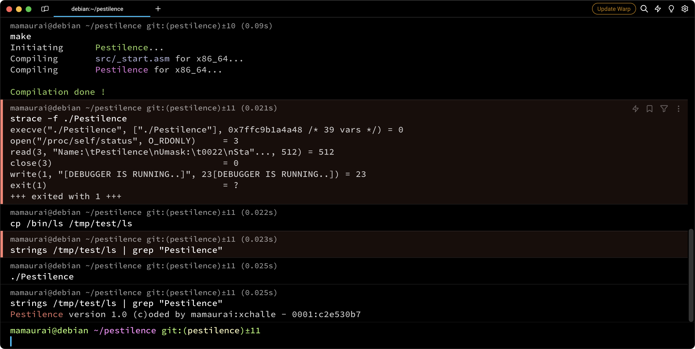
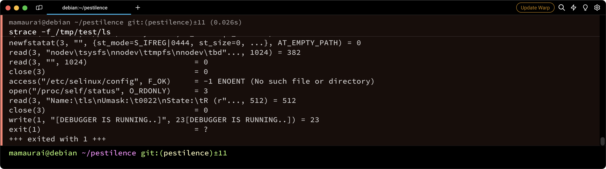
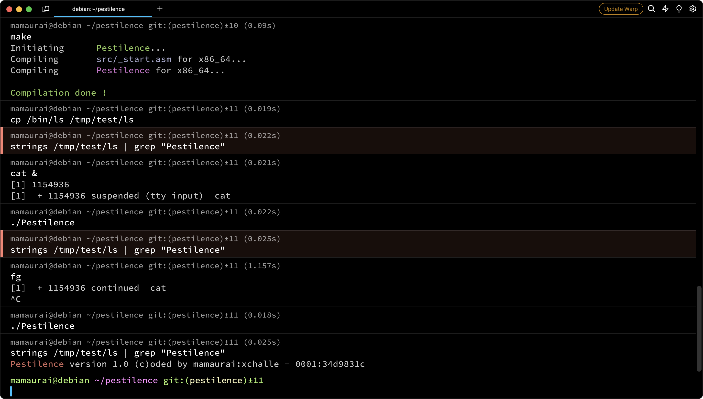
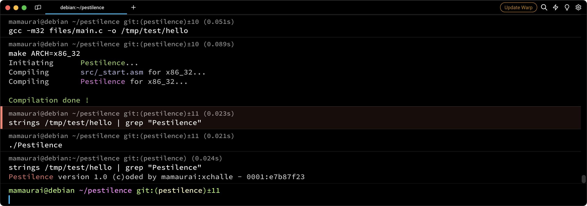
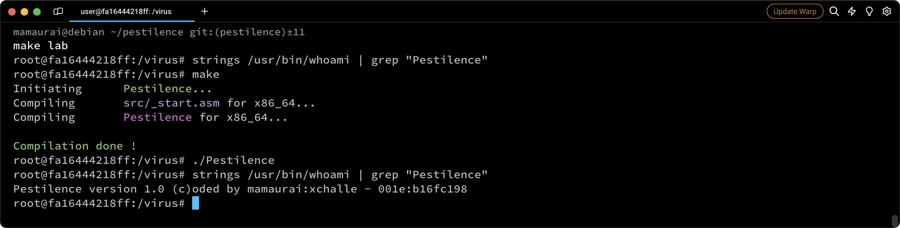
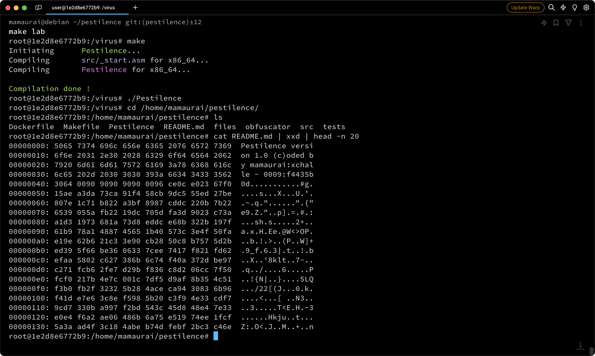
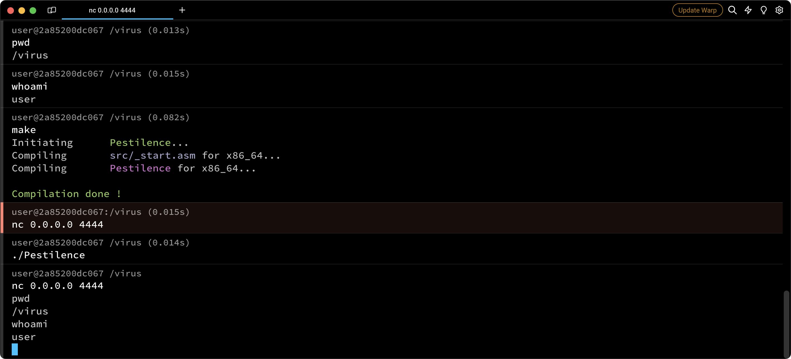
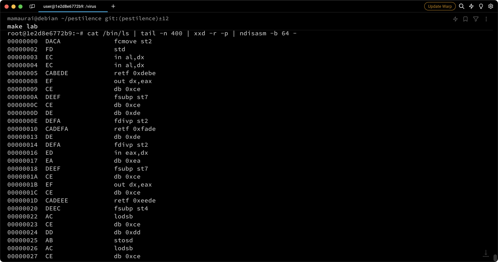

<p align="center">
  
</p>

---
<p align="center">
    
    
    
    
    
    
</p>


> A Linux ELF virus designed to operate on both 64-bit and 32-bit systems, featuring anti-debugging techniques, conditional execution, and code obfuscation.

## 📝 Table of Contents

* [⛔️ Warning](#-warning)
* [❓ What is it](#-what-is-it)
* [⚙️ How it works](#-how-it-works)
* [⭐ Bonus features](#-bonus-features)
* [📋 Prerequisites](#-prerequisites)
* [🔧 Install](#-install)
* [🚀 Usage](#-usage)

## ⛔️ Warning

The sharing of this project on my GitHub aims to help peoples to open their minds to new logics or help peoples in case of difficulty. In no way, that aims to copy and paste this work on your own repository.

This executable can do great damage to your computer if it is run, I strongly recommend that you run it in a separate and secure environment away from your personal data.

## ❓ What is it

This project is a direct improvement of the previous virus [Famine](https://github.com/mathias-mrsn/famine). Pestilence requires us to create a virus capable of concealing itself through anti-debugging techniques, conditional execution, and code obfuscation. Pestilence builds upon the features implemented in [Famine](https://github.com/mathias-mrsn/famine), so I highly recommend reading [Famine](https://github.com/mathias-mrsn/famine) to grasp what is incorporated into Pestilence, as I will only explain new features in this README.

This project aims to create an ELF executable that can embed its own code within a target file.
In our case, our target is not a single file but two directories for the mandatory part.
Those directories are `/tmp/test` and `/tmp/test2`.
To consider a file "infected," the file must contain the virus code that we have coded.
It should be executed by the file when you run it without altering its original behavior and without printing anything.
Otherwise, our virus would be detected. After being infected, the targeted file will contain a `signature` in this form: `Pestilence version 1.0 (c)oded by mamaurai:xchalle - 0000:11111111`, where `0000` is just an index to determine the infection order of each process and `11111111` is the beginning of an encryption key used to encrypt the malicious payload every time the program is duplicated.

Before infecting a system, the virus will also check for the presence of any debugger. If a debugger is detected, it will print the message `[DEBUGGER IS RUNNING...]` and exit. Following this, the program will be decrypted, and it will check if any of the following processes are running: `cat`, `vim`, or `grep`. If any of these processes are detected, the infection will not proceed.

## ⚙️ How it works

Again, I will only explain how the new mandatory features of Pestilence work. To understand how the virus infects other files, please refer to the [Famine](https://github.com/mathias-mrsn/famine) repository.

Let's start with the anti-debugging techniques. The first one involves a `/proc/status/self` check. The program will open the file and then check the `TracerPID:` line. If this line isn't set to 0, it indicates that a tracer process like `strace` or `gdb` is running, and the virus stops.

The second anti-debugging technique is the time-check technique. This involves running a loop 50000 times and comparing the time at the beginning of the loop with the time at the end. If the result is too high, it suggests that a debugger may be running, especially `gdb`.

The third technique is the environment variable check. In `gdb`, when the program is running, two environment variables are set: `COLUMNS` and `LINES`. If these variables are set, most of the time, it indicates that a debugger is running.

The final check involves a ptrace check. The virus will fork a process to attach to it, and the PTRACE_ATTACH will return (-1) if the process is already attached to GDB.

<p align="center">
  
  
</p>

Now let's revisit Pestilence's features. The second one is `conditional execution`. This technique is employed to conceal the virus's execution and introduce more randomness.

To achieve this, the program opens the `/proc` directory and checks the name of every process in this folder, comparing them to the predefined process names set in our code. If a comparison is successful, the program exits. Quite simple.

<p align="center">
  
</p>

And finally, the code obfuscation has been implemented by a CPP program that I created, but I'll keep it a secret 🤭 (quite simple too).

## ⭐ Bonus features

This project opens the door to many potential bonuses. For this project, we have decided to implement six bonus features:

<details open>
<summary><b>32 Bits Compatibility</b></summary>
<br>

We decided to leverage the wide possibilities of NASM preprocessing to create a coding approach that works on both 64-bit and 32-bit architectures. Here is how assemble it for 32bits:
```shell
$ make re ARCH=x86_32
$ ./Pestilence
```

<p align="center">
  
</p>
</details>

<details open>
<summary><b>Root Infection</b></summary>
<br>

At the beginning of the infection routine, the virus will query the kernel for the UID to determine whether the executable has been run with root privileges or via sudo. If the UID is greater than zero, the virus will only infect `/tmp/test` and `/tmp/test2`, as explained above. However, if the UID is zero, indicating root privileges, the virus will infect the following directories: `/bin`, `/usr/bin`, `/usr/local/bin`. Subsequently, almost all executables on the machine will be infected and capable of infecting other files. For example, if you run `ls` as root in the `/home` directory, the resulting subfiles will be infected, potentially leading to the corruption of personal files with our signature.

<p align="center">
  
</p>
</details>

<details open>
<summary><b>Non-Binary Infection</b></summary>
<br>

As mentioned above, if the virus is executed as root in the `/home` directory, it will infect non-binary files. In this project, the infection involves placing the virus signature at the top of every file and encrypted the entire file with an AES-256 encryption algorithm.

<p align="center">
  
</p>
</details>

<details open>
<summary><b>Packer</b></summary>
<br>

Our virus implements a packing algorithm called `lzss`. This algorithm is designed to minimize the size of the virus within the targeted ELF. The code will be unpacked during runtime. The algorithm is lossless and relies on the repetition of patterns within the code.
</details>

<details open>
<summary><b>Backdoor</b></summary>
<br>

To make our virus even more impactful, we decided to implement a backdoor routine. This routine is executed after decryption and is designed to initiate a malicious process on your machine, which can be highly advantageous for an unauthorized person seeking access or to exploit your machine for financial gain.

The backdoor routine first checks if you are the root user. If not, the virus will open a port in a separate process and listen for incoming requests on this port. Each request sent to this port will be redirected to a bash process, creating a reverse shell with the same privileges as the executor.

<p align="center">
  
</p>

If the user is the root user, the process will redirect `stdin`, `stdout`, and `stderr` to `/dev/null`. Subsequently, it will run a Minero miner on the targeted machine.

</details>

<details open>
<summary><b>AES Encryption</b></summary>
<br>

For enhanced obfuscation of the virus within an ELF, a significant portion of the virus is encrypted using the AES algorithm with a 256-bit key. The code is self-decrypted at runtime by leveraging the Intel Advanced Encryption Standard New Instructions implemented in 2008 on Intel and AMD, ensuring better optimization of this cryptographic algorithm.

<p align="center">
  
</p>
</details>

## 📋 Prerequisites

- `make`
- `nasm`
- `ld`

## 🔧 Install

```sh
$ git clone https://github.com/mathias-mrsn/pestilence.git
```

## 🚀 Usage

```sh
# Run it in secure environment
$ cd pestilence
$ make
[...]
$ (sudo) ./Pestilence
```

## 👥 Authors
- [@mathias-mrsn](https://github.com/mathias-mrsn)
- [@xchalle](https://github.com/xchalle)
